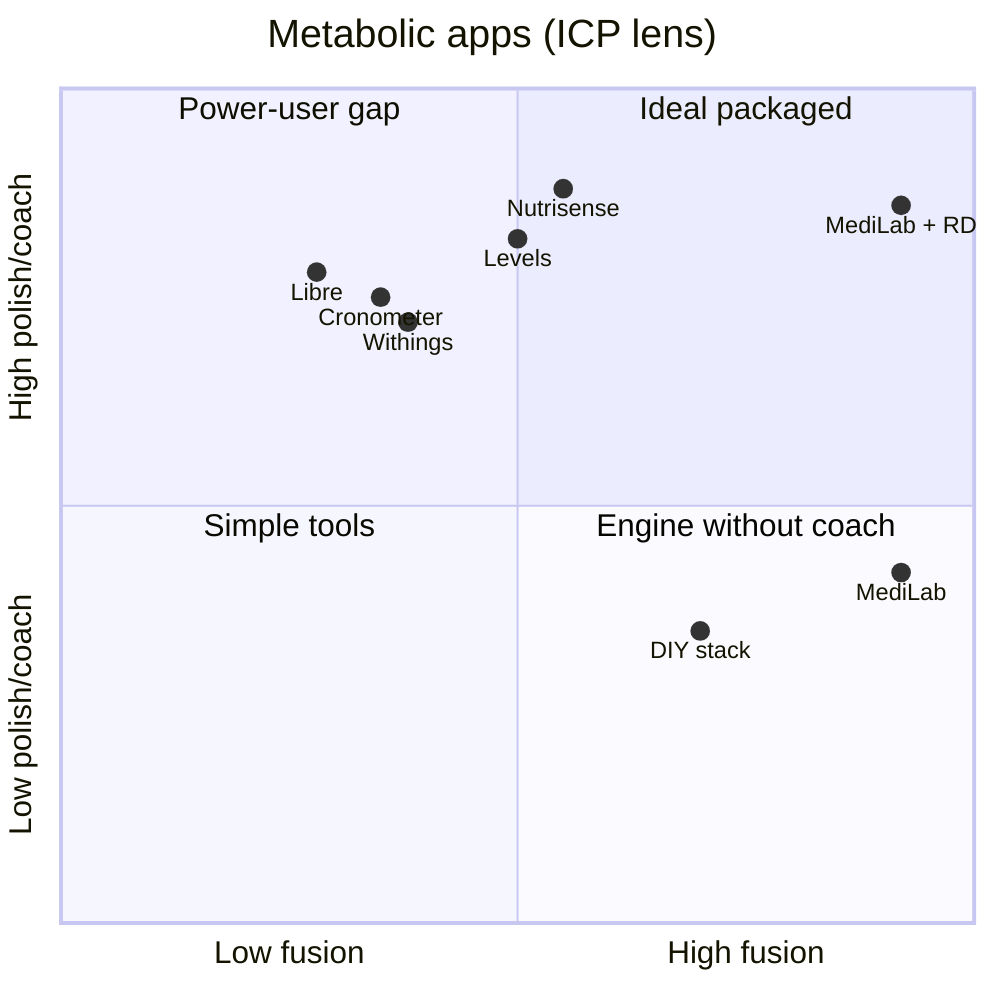

# MediLab — Competitor scores & positioning

**For:** advisor / investor / clinic conversations  
**Date:** June 2026  
**Related:** [EXECUTIVE-SUMMARY.md](./EXECUTIVE-SUMMARY.md) · [README.md](./README.md)

---

## How to read these scores

- **0–100** = subjective strength **for one ICP only** (not “best app in the world”).
- **Not clinical evidence** — positioning memo, not a study.
- Re-score when product, Nutrisense feature set, or GTM changes.

### ICP (ideal customer profile)

Same hardware and habits as founder POC:

- **CGM:** Libre / CareSens via Health Connect or xDrip+
- **Scale:** Withings (weight, body comp, BMR)
- **Food:** daily log (photo AI + text)
- **Labs:** LDL / A1c / kidney matter for daily eating
- **Goal:** daily **macro targets + meals**, not glucose chart only
- **Optional:** local RD (clinic) approves targets

---

## Overall scores (ICP)

| App / stack | Score | One-line why |
|-------------|------:|--------------|
| **MediLab + clinic RD** | **88** | Fusion + human coach — strongest full package |
| **MediLab** (solo) | **78** | Best macro engine & fusion; weak packaged coach + polish |
| **Nutrisense** | **72** | Best packaged coach + UX; thinner Withings + labs → macros |
| **Levels** | **68** | Strong CGM lifestyle; no labs / Withings macro depth |
| **4-app stack + ChatGPT** | **58** | Can work if user is the daily integrator |
| **Cronometer** | **48** | Best food DB; not a metabolic OS |
| **Withings app** | **35** | Best scale UX; no CGM / food / lab loop |
| **Libre app** | **32** | Best native CGM; not a nutrition OS |

### Visual (ICP)

```
MediLab + RD  ████████████████████  88
MediLab       █████████████████░░░  78
Nutrisense    █████████████████░░░  72
Levels        ████████████████░░░░  68
DIY stack     ██████████████░░░░░░  58
Cronometer    ███████████░░░░░░░░░  48
Withings      ████████░░░░░░░░░░░░  35
Libre         ███████░░░░░░░░░░░░░  32
```

---

## Category scores (0–100, same ICP)

| Category | MediLab | + clinic RD | Nutrisense | Levels | Cronometer | Libre | Withings |
|----------|--------:|------------:|-----------:|-------:|-----------:|------:|---------:|
| **Macro engine** (daily revise) | **92** | 92 | 55 | 50 | 25 | 10 | 15 |
| **Data fusion** (CGM+scale+food+labs) | **95** | 95 | 52 | 48 | 35 | 28 | 40 |
| **CGM + meals loop** | 82 | 82 | **88** | **85** | 30 | 75 | 10 |
| **Food logging** | 68 | 68 | 78 | 72 | **90** | 25 | 5 |
| **Human coach** | 25 | **90** | **92** | 80 | 15 | 10 | 10 |
| **UX / polish / retention** | 45 | 50 | **88** | **85** | 80 | **82** | **78** |
| **Language / local** (IL, multi-lang AI) | **85** | **85** | 35 | 35 | 70 | 75 | 75 |
| **Setup ease** (higher = easier) | 55 | 55 | **82** | **80** | **85** | **90** | **88** |

**MediLab leads:** macro engine, data fusion, language/local.  
**Nutrisense leads:** coach, polish, CGM meal UX, setup ease.  
**Cronometer leads:** food logging accuracy.

---

## Weighted overall (how 78 / 72 were derived)

| Weight | Category |
|-------:|----------|
| 25% | Macro engine |
| 20% | Data fusion |
| 15% | CGM + meals |
| 10% | Food logging |
| 10% | Human coach |
| 10% | UX / polish |
| 5% | Language / local |
| 5% | Setup ease |

**MediLab solo ≈ 78** · **MediLab + clinic RD ≈ 88** (coach 25→90) · **Nutrisense ≈ 72**

---

## Positioning map — who is strongest where

### Quadrant: depth of fusion vs ease + coach



**Read it:**

- **MediLab** sits **far right** (best **fusion**) but **lower** on polish/coach alone.
- **MediLab + clinic RD** moves into the **top-right** — fusion + human.
- **Nutrisense** is **top-left** — great coach/polish, weaker full fusion.
- **Libre / Withings / Cronometer** = strong on **one pillar**, weak fusion.

### ASCII — fusion vs single-pillar strength

```
                    FUSION (CGM + scale + food + labs → daily macros)
                              ↑
                         MEDILAB ★
                    MediLab+RD ★★
                              |
    Cronometer ←—— food ————+——— CGM ———→ Nutrisense / Levels
                              |
                    Libre · Withings
                              ↓
                    single-sensor / single-job apps
```

★ **MediLab wins fusion** for the ICP — not “best at everything.”

---

## Head-to-head: MediLab vs Nutrisense

| Dimension | MediLab | Nutrisense | Edge |
|-----------|---------|------------|------|
| Daily macro from all data | ✅ engine | ⚠️ partial | **MediLab** |
| Withings → calories/macros | ✅ built-in | ⚠️ weak | **MediLab** |
| Labs → P/C/F logic | ✅ | ❌ | **MediLab** |
| Photo food → same brain as `/macros` | ✅ | ✅ | Tie |
| CGM meal feedback | ✅ `/7` | ✅ meal scores | Tie / Nutrisense UX |
| Real dietitian | ❌ → clinic | ✅ | **Nutrisense** (until clinic) |
| App polish & onboarding | ⚠️ | ✅ | **Nutrisense** |
| Coach weekly brief (complex client) | ✅ rich | ⚠️ thinner | **MediLab** |
| Multi-language metabolic coaching | ✅ AI (7+ langs) | ❌ US-centric | **MediLab** |

**Beat Nutrisense:** IL + labs + Withings + multi-goal + **local RD on MediLab brief**.  
**Lose to Nutrisense:** US mass market, “easy CGM + coach in a box.”  
**Deep dive:** [Nutricence-medilab.md](./Nutricence-medilab.md)

---

## Same apps — casual user (“just want CGM tips”)

Scores **flip** when the job is not the ICP:

| App | Score | Why |
|-----|------:|-----|
| **Nutrisense** | **85** | Coach + easy onboarding |
| **Libre** | **82** | Simple glucose |
| **Levels** | **80** | Polished membership |
| **MediLab** | **42** | Overkill + setup friction |

---

## Fair pitch lines

**Weak:** “We beat Nutrisense at everything.”

**Strong:** “For Libre + Withings + labs users who log daily, MediLab scores **78** on metabolic OS fit vs Nutrisense **72** — we win **fusion and macro engine**; they win **coach and polish**. **MediLab + clinic RD at ~88** is the model that can win our wedge.”

**One sentence:** Nutrisense = better **coach in a box**. MediLab = better **metabolic file + daily macro engine**. Together with a clinic = **both**.

---

## Document history

| Date | Note |
|------|------|
| 2026-06-20 | Initial competitor scores & positioning map |

---

*Subjective positioning only. Not medical or investment advice.*
