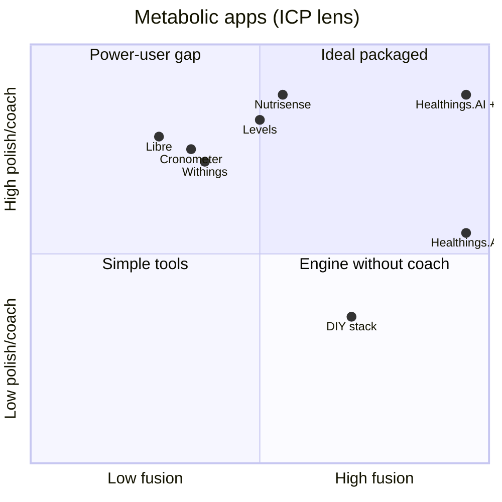

# Healthings.AI — Competitor scores & positioning

**For:** advisor / investor / clinic conversations  
**Date:** August 2026  
**Related:** [EXECUTIVE-SUMMARY.md](./EXECUTIVE-SUMMARY.md) · [README.md](./README.md) · **[HTML presentation](./COMPETITOR-SCORES.html)** (Idit pitch styling)

---

## How to read these scores

- **0–100** = subjective strength **for one ICP only** (not “best app in the world”).
- **Not clinical evidence** — positioning memo, not a study.
- Re-score when product, Nutrisense feature set, or GTM changes.

### ICP (ideal customer profile)

Same hardware and habits as founder POC:

- **CGM:** Libre / CareSens via Health Connect or xDrip+
- **Scale:** Withings (weight, body comp, BMR)
- **Food:** daily log (photo AI + text)
- **Activity:** Activity Log + **YouTube training AI** calorie-burn model (workout sessions → energy balance)
- **Labs:** BYO lab **PDF import** → AI (LDL / A1c / kidney) → daily eating / macros
- **Goal:** daily **macro targets + meals**, not glucose chart only
- **Optional:** local RD (clinic) approves targets

---

## Overall scores (ICP)

Weighted from [Category scores](#category-scores-0100-same-icp) (includes **Nutritionist sessions**).

| App / stack | Score | Market price (USD, ~Aug 2026) | One-line why |
|-------------|------:|-------------------------------|--------------|
| **Healthings.AI + clinic RD** | **89** | **Pay as you go** AI + RD **when you choose** (clinic) | Local-first phone + explicit clinic share + rules loop — not $200/mo cloud coach |
| **Healthings.AI** (solo) | **83** | **Pay as you go** · **$5 / 100 cr** · ~**$15–25**/active mo (~**90% less** than ~$200 Nutrisense) | **Local-first** metabolic file + rules→real-time correction + AI food log; sessions via clinic / BYO RD |
| **Levels** | **63** | App **~$15/mo** · Core **~$41** · Complete **~$167** | Polished CGM cloud membership; weak rules→auto-correct / local-first |
| **Nutrisense** | **62** | **~$150–225/mo** sensors · BYO **~$39/mo** | Best **packaged RD sessions** + meal scores; cloud coach platform, thinner fusion |
| **4-app stack + ChatGPT** | **58** | ChatGPT **~$20/mo** + apps | Strong generic AI chat if user pastes the file; no closed loop |
| **Cronometer** | **42** | Free · Gold **~$50/yr** | Best food DB; account sync — not local-first metabolic OS |
| **Libre app** | **33** | **Free** (sensors separate) | Best native glucose chart; vendor cloud; not meals/HR/energy OS |
| **Withings app** | **33** | Free · Withings+ **~$10/mo** | Scale / activity trends; vendor cloud; no CGM meal loop |

See [Market prices](#market-prices-usd--aug-2026) for prepaid vs subscription vs sensor bundle.

### Visual (ICP)

```
Healthings.AI + RD  ████████████████████░  89
Healthings.AI       ██████████████████░░░  83
Levels              ███████████████░░░░░░  63
Nutrisense          ███████████████░░░░░░  62
DIY stack           ██████████████░░░░░░░  58
Cronometer          ██████████░░░░░░░░░░░  42
Libre               ████████░░░░░░░░░░░░░  33
Withings            ████████░░░░░░░░░░░░░  33
```

---

## Market prices (USD, ~Aug 2026)

Compare **apples carefully**: some prices include **CGM sensors + coach**; others are **app-only** (BYO Libre / CareSens / Withings hardware). Healthings is **pay-as-you-go AI credits** — you buy packs when you use the coach, not a locked **~$200/mo** membership.

| Product | Typical price | Bundle | Source / note |
|---------|---------------|--------|----------------|
| **Healthings.AI** (solo or + clinic RD) | **Pay as you go:** **$5 / 100 AI credits** · est. **~$15–25** in an active month | App; **BYO** CGM + scale | Use when you need AI. Quiet months cost less. ≈ **90% off** a Nutrisense sensor month. Same tokens with or without RD |
| **Clinic RD** (optional) | **You decide when** — pay the clinic for that visit / engagement | Human RD on Healthings brief | **Not** “$200 every month for a dietitian.” Closed loop (CGM + scale + food + labs → macros) carries the day-to-day; RD when *you* choose |
| **Nutrisense** CGM program | **~$151–225/mo** equiv. (commitment / promo); list often from **~$179/mo** | **Sensors + app** + RD options | [nutrisense.io](https://www.nutrisense.io/what-is-a-cgm/cost) — longer plans cheaper /mo |
| **Nutrisense** BYO sensor | **~$39/mo** | App (+ RD options if eligible) | Same site — own CGM |
| **Levels** Build / app | **~$15/mo** or **$80/yr** | App; CGM/labs **à la carte** | Levels support / pricing (2026) |
| **Levels** Core | **~$41/mo** ($499/yr) | App + limited CGM/labs bundle | Annual bill |
| **Levels** Complete | **~$167/mo** ($1,999/yr) | Deeper labs + more CGM + concierge | Annual bill |
| **Cronometer** | **Free** / Gold **~$50/yr** | Food tracking | Gold ≈ $4–5/mo effective |
| **Withings+** | **~$9.95/mo** or **~$99.50/yr** | Insights on Withings hardware | Hardware purchase separate |
| **Libre / LibreLink** | **Free** app | Native CGM UX | Sensors: pharmacy / OTC / insurance — **not** in app price |
| **DIY stack** | ChatGPT Plus **~$20/mo** + apps | User glues tools | Time cost ignored in $ |

**Pitch use:** Nutrisense often means **~$150–225 every month** (sensors + packaged RD). Healthings is **pay as you go**: buy AI credits when you use them (~**$15–25** in a busy month), and see a nutritionist **only when you decide** — pay the clinic then. You don’t need a standing **~$200/mo** coach bill because the **closed loop** (CGM + Withings + food + lab PDF + activity → daily macros) does the continuous work. Solo and +RD share the **same token economy**.

---

## Category scores (0–100, same ICP)

**Price / value** = value for the ICP *job* (metabolic OS + BYO hardware), not “cheapest app.”  
**Lab reports** = BYO lab PDF → structured markers → **AI context** (another fusion input).  
**AI chats** ≠ **Human coach** ≠ **Nutritionist sessions**.  
- **AI chats** = conversational coach with the closed-loop file.  
- **Human coach** = ongoing licensed-RD *relationship / access*.  
- **Nutritionist sessions** = *visit workflow* — prep brief, clinic tools, what the RD sees before/during a session. Nutrisense wins **packaged video+chat cadence**; Healthings + clinic wins **brief depth** (RD arrives with the full file). Solo = export / BYO RD only (**42**), not an in-app session SKU.  
**Charts & energy trends** = one timeline (glu + HR + meals + kcal). **CGM + meals** = meal-score packaging.  
**Rules → closed-loop correction** ≠ Macro engine. Macro = P/C/F math + burn. **Rules correction** = My Rules / clinic directives as HARD policy + **real-time revise** when weigh-in, labs, or energy data lands (auto-apply).  
**Privacy / local-first** = canonical health file lives **on the phone** (AsyncStorage / metrics store); AI is called with context when the user acts; clinic / cloud backup are **explicit opt-in** — not a cloud coach silo that owns the record. Nutrisense / Levels / Libre / Withings are vendor-cloud by default.

| Category | Wt | Healthings.AI | + clinic RD | Nutrisense | Levels | Cronometer | Libre | Withings |
|----------|---:|--------------:|------------:|-----------:|-------:|-----------:|------:|---------:|
| **Macro engine** (daily revise + burn) | 13% | **94** | 94 | 55 | 50 | 25 | 10 | 15 |
| **Data fusion** (CGM+scale+food+labs+activity) | 10% | **97** | 97 | 52 | 48 | 35 | 28 | 40 |
| **Rules → closed-loop correction** | 7% | **94** | **94** | 45 | 40 | 35 | 10 | 15 |
| **Privacy / local-first** | 6% | **92** | 88 | 38 | 40 | 52 | 42 | 45 |
| **Lab reports** (PDF → AI inputs) | 6% | **95** | 95 | 22 | 75 | 28 | 8 | 8 |
| **AI chats** (context-rich coach chat) | 6% | **90** | **90** | 78 | 70 | 38 | 12 | 22 |
| **Charts & energy trends** (glu+HR+meals+kcal) | 6% | **92** | **92** | 82 | 80 | 35 | 70 | 50 |
| **Activity / training log** (YouTube AI kcal) | 6% | **90** | 90 | 58 | 55 | 42 | 12 | 65 |
| **Price / value** (pay as you go vs ~$200/mo) | 6% | **90** | **90** | 48 | 72 | 58 | 52 | 55 |
| **CGM + meals loop** | 6% | 84 | 84 | **88** | **85** | 30 | 75 | 10 |
| **Food logging** (photo / AI chat / reuse / item g) | 5% | **88** | **88** | 78 | 72 | **90** | 25 | 5 |
| **Human coach** | 5% | 25 | **90** | **92** | 80 | 15 | 10 | 10 |
| **Nutritionist sessions** (brief + visit workflow) | 6% | 42 | **93** | **90** | 74 | 18 | 12 | 12 |
| **UX / polish / retention** | 4% | **60** | **64** | **88** | **85** | 80 | **82** | **78** |
| **Language / local** (IL, multi-lang AI) | 4% | **85** | **85** | 35 | 35 | 70 | 75 | 75 |
| **Setup ease** (higher = easier) | 4% | 56 | 56 | **82** | **80** | **85** | **90** | **88** |
| **TOTAL (weighted)** | **100%** | **83** | **89** | **62** | **63** | **42** | **33** | **33** |

**Rescore note (2026-08):** Added **Privacy / local-first (6%)** — phone is source of truth; AI/clinic are opt-in pipes, not the vault. Healthings **92** (solo) / **88** (+RD, explicit clinic share). Nutrisense **38**, Levels **40** (cloud membership). Food logging already **88**. Overall solo **82→83**, +RD **89**; Nutrisense **64→62**, Levels **64→63**.

**Rescore note (2026-08-08, prompt106):** **UX / polish / retention** **52→60** (solo) / **56→64** (+RD) — What’s next CTA, calm empty states, empty-today Food/Activity auto-expand, Add activity dark punch-out. Still well below Nutrisense **88**; weighted solo **~83**.

**Healthings.AI leads:** macro, fusion, **rules→real-time correction**, **privacy / local-first**, labs, AI chats, charts & energy, activity, price, language; **near-lead food log UX**; **+RD also session brief**.  
**Nutrisense leads:** human coach, **packaged sessions**, polish, CGM meal scores, setup.  
**Levels:** polished CGM + optional RDN — weak auto rules loop / local-first.  
**Cronometer leads:** food **database** depth (barcode / micros) — not meal-edit UX.  
**Libre / Withings:** chart or device pillars; vendor cloud.

---

## Weighted overall (how 83 / 62 were derived)

| Weight | Category |
|-------:|----------|
| 13% | Macro engine |
| 10% | Data fusion |
| 7% | Rules → closed-loop correction |
| 6% | Privacy / local-first |
| 6% | Lab reports (PDF → AI) |
| 6% | AI chats (context-rich) |
| 6% | Charts & energy trends |
| 6% | Activity / training log |
| 6% | Price / value |
| 6% | CGM + meals |
| 5% | Food logging |
| 5% | Human coach |
| 6% | Nutritionist sessions |
| 4% | UX / polish |
| 4% | Language / local |
| 4% | Setup ease |

**Healthings.AI solo ≈ 83** · **Healthings.AI + clinic RD ≈ 89** · **Levels ≈ 63** · **Nutrisense ≈ 62**

---

## Positioning map — who is strongest where

### Quadrant: depth of fusion vs ease + coach



**Read it:**

- **Healthings.AI** sits **far right** (best **fusion**, incl. activity / YouTube AI burn) but **lower** on polish/coach alone.
- **Healthings.AI + clinic RD** moves into the **top-right** — fusion + human.
- **Nutrisense** is **top-left** — great coach/polish, weaker full fusion.
- **Libre / Withings / Cronometer** = strong on **one pillar**, weak fusion.

### ASCII — fusion vs single-pillar strength

```
                    FUSION (CGM + scale + food + labs + activity → daily macros)
                              ↑
                    HEALTHINGS.AI ★
               Healthings.AI+RD ★★
                              |
    Cronometer ←—— food ————+——— CGM ———→ Nutrisense / Levels
                              |
                    Libre · Withings
                              ↓
                    single-sensor / single-job apps
```

★ **Healthings.AI wins fusion** for the ICP — not “best at everything.”

---

## Head-to-head: Healthings.AI vs Nutrisense

| Dimension | Healthings.AI | Nutrisense | Edge |
|-----------|---------------|------------|------|
| Daily macro from all data | ✅ engine | ⚠️ partial | **Healthings.AI** |
| My Rules → real-time target correction | ✅ closed loop | ⚠️ coach / manual | **Healthings.AI** |
| Withings → calories/macros | ✅ built-in | ⚠️ weak | **Healthings.AI** |
| Lab PDF → AI / structured markers | ✅ import | ❌ | **Healthings.AI** |
| Labs → P/C/F / daily macros | ✅ wired in | ❌ | **Healthings.AI** |
| Activity / YouTube AI burn → energy | ✅ Activity Log | ⚠️ thinner | **Healthings.AI** |
| Photo / AI chat / reuse / item-g edit | ✅ strong UX | ✅ photo + scores | **Healthings.AI** (edit UX) |
| Photo food → same brain as `/macros` | ✅ | ✅ | Tie |
| CGM meal feedback | ✅ `/7` | ✅ meal scores | Tie / Nutrisense UX |
| Real dietitian | ❌ → clinic | ✅ | **Nutrisense** (until clinic) |
| App polish & onboarding | ⚠️ | ✅ | **Nutrisense** |
| AI chats (full metabolic file in prompt) | ✅ Gemini + `/macros` `/7` | ✅ Nora (polished, thinner file) | **Healthings.AI** (context) |
| Charts: glucose + HR + meals + energy | ✅ one MetabolicChart | ⚠️ glu+meals+activity (less HR/kcal strip) | **Healthings.AI** |
| Coach weekly brief (complex client) | ✅ rich | ⚠️ thinner | **Healthings.AI** |
| Multi-language metabolic coaching | ✅ AI (7+ langs) | ❌ US-centric | **Healthings.AI** |
| Price / value (BYO CGM ICP) | ✅ **pay as you go** (~**90% off** ~$200/mo) | ⚠️ often **~$150–225 every month** | **Healthings.AI** |
| Continuous coach bill | ❌ not required — closed loop | ✅ packaged RD month | **Healthings.AI** |
| Privacy / local-first | ✅ phone vault; AI/clinic opt-in | ⚠️ cloud coach platform | **Healthings.AI** |
| Nutritionist timing | ✅ **you decide** (clinic visit) | ⚠️ membership meter | **Healthings.AI** |
| Nutritionist sessions (brief quality) | ✅ clinic brief from full file | ✅ packaged video+chat cadence | Tie / **+RD depth** vs **NS packaging** |

**Beat Nutrisense:** IL + labs + Withings + activity burn + multi-goal + **local RD on Healthings.AI session brief** + ~**90% lower** software month.  
**Lose to Nutrisense:** US mass market, “easy CGM + coach sessions in a box.”  
**Deep dive:** [Nutricence-medilab.md](./Nutricence-medilab.md)

---

## Same apps — casual user (“just want CGM tips”)

Scores **flip** when the job is not the ICP:

| App | Score | Why |
|-----|------:|-----|
| **Nutrisense** | **85** | Coach + easy onboarding |
| **Libre** | **82** | Simple glucose |
| **Levels** | **80** | Polished membership |
| **Healthings.AI** | **44** | Overkill + setup friction (slightly less friction with YouTube activity) |

---

## Fair pitch lines

**Weak:** “We beat Nutrisense at everything.”

**Strong:** “For Libre + Withings + labs users who log food and training daily, Healthings.AI scores **83** solo vs Nutrisense **62**. We win **local-first privacy**, **My Rules → real-time correction**, fusion, fused charts, **AI food log**, and **pay-as-you-go**. They win **packaged nutritionist sessions** + meal-score polish. **+ clinic RD (~89)** — RD walks in with the full brief; you still don’t pay ~$200 every month.”

**One sentence:** Nutrisense = **~$200/mo cloud sessions in a box**. Healthings = **local-first closed loop** that corrects targets from your rules — RD when you choose.

---

## Document history

| Date | Note |
|------|------|
| 2026-06-20 | Initial competitor scores & positioning map (as MediLab) |
| 2026-08-08 | Rename to Healthings.AI; rescore for Activity Log + YouTube training AI kcal |
| 2026-08-08 | Dedicated **Activity / training log** category row (weight 10%) |
| 2026-08-08 | Market subscription prices table (USD; software vs sensor bundle) |
| 2026-08-08 | Healthings prepaid **$5/100 credits**; **Price / value** category (12%); weighted TOTAL row; overall **79 / 85 / 66** |
| 2026-08-08 | Frame Healthings vs Nutrisense sensors as ~**90% discount** (~$15–25 vs ~$150–225/mo) |
| 2026-08-08 | **Lab reports** category (10%) — PDF → AI fusion input; overall **80 / 86 / 62** (Levels 66) |
| 2026-08-08 | Solo and +RD: **same** app token price / Price score (**90**); clinic fee paid to clinic |
| 2026-08-08 | Pitch: **pay as you go** + RD when you choose vs Nutrisense **~$200/mo**; closed loop replaces standing coach bill |
| 2026-08-08 | **AI chats** category (9%) ≠ Human coach; overall **81 / 87 / 63** |
| 2026-08-08 | **Charts & energy trends** (8%) — glu+HR+meals+kcal one timeline; Nutrisense **65**, Levels **67** |
| 2026-08-08 | **Nutritionist sessions** (8%) ≠ Human coach; solo **79**, +RD **87**, Nutrisense **66** |
| 2026-08-08 | **Rules → closed-loop correction** (8%); overall **81 / 88 / 64** |
| 2026-08-08 | Food logging **68→88** (photo/AI/reuse/item-g); overall **82 / 89 / 64** |
| 2026-08-08 | **Privacy / local-first** (6%); Nutrisense **62**, Levels **63** |
| 2026-08-08 | **UX / polish** **52→60** / **56→64** (prompt106 What’s next + habit expand); solo overall **82→83** |

---

*Subjective positioning only. Not medical or investment advice.*
