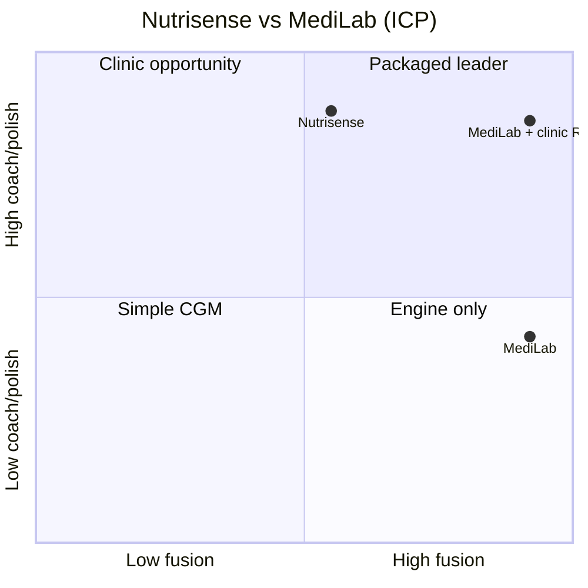

# Nutrisense vs MediLab

**Battle card** — advisor, clinic, and GTM conversations  
**Date:** June 2026  
**Related:** [COMPETITOR-SCORES.md](./COMPETITOR-SCORES.md) · [EXECUTIVE-SUMMARY.md](./EXECUTIVE-SUMMARY.md)

---

## TL;DR

| | Nutrisense | MediLab | MediLab + clinic RD |
|--|------------|---------|---------------------|
| **What it is** | US CGM membership + **packaged dietitian** | **Daily macro OS** (CGM + Withings + food + labs) | Fusion + **local licensed RD** |
| **ICP score** (see [scores](./COMPETITOR-SCORES.md)) | **72** | **78** | **88** |
| **Wins on** | Coach, polish, easy CGM onboarding | Fusion, macro engine, labs, Withings, language | **Both** — if clinic uses the brief |
| **Loses on** | Withings depth, labs → macros, IL/local | Solo coach, polish, iOS, US brand | Product polish vs Nutrisense app |

**Fair claim:** MediLab + clinic **can beat Nutrisense in our wedge** (Libre + Withings + labs + multi-goal + IL). **Not proven** until clinic pilot. **Not** “beat them globally.”

---

## Two different products

### Nutrisense

> *“We coach your glucose and meals — with a real dietitian in the app.”*

- CGM (BYO Libre/Dexcom/Stelo) + food log + meal scores  
- **Human RD** in US model (sometimes insurance)  
- Sleep / steps via Apple Health / Google Fit  
- **English-first**, polished iOS + Android  
- Weak: **Withings BMR/body comp → daily macros**, **lab PDF → P/C/F**

### MediLab

> *“We run your metabolic week — glucose, scale, food, labs → today’s macro targets.”*

- Libre/CareSens (HC/xDrip+) + **Withings API** + photo/text food + **lab PDF**  
- **Macro engine** revises on weigh-in / labs; **confirm + lock**  
- AI mentors + `/7` weekly meal↔glucose  
- **7 languages** via Gemini (en, he, es, fr, de, ar, ru)  
- Weak: **packaged coach**, polish, mass-market onboarding  

### MediLab + clinic RD (the synergy)

> *“Same dietitian relationship — but the client arrives with a full metabolic brief, not screenshots.”*

```
Client daily:  log meals (photo AI) + CGM + Withings + labs in MediLab
Before visit: RD opens weekly export (/7, macros, trends, labs)
In session:   RD adjusts plan; client confirms targets in app
```

---

## Positioning map



**Nutrisense** = top-left (great coach, partial fusion).  
**MediLab alone** = bottom-right (best fusion, weak coach).  
**MediLab + clinic** = top-right — **the beat path**.

---

## Head-to-head table

| Dimension | Nutrisense | MediLab | MediLab + clinic |
|-----------|------------|---------|------------------|
| **CGM + meals** | ✅ meal scores | ✅ `/7` + log | ✅ |
| **Withings → macros** | ⚠️ indirect | ✅ **core** | ✅ |
| **Labs → daily P/C/F** | ❌ | ✅ **core** | ✅ |
| **Macro draft to approve** | ⚠️ manual | ✅ engine | ✅ RD signs off |
| **Real dietitian** | ✅ built-in | ❌ | ✅ local RD |
| **Coach knows person** | ✅ **strong** | ⚠️ AI only | ✅ RD |
| **Coach knows facts** | ⚠️ CGM+food mainly | ✅ **full fusion** | ✅ **best brief** |
| **Food logging** | ✅ barcode | ✅ photo AI | ✅ |
| **Languages / IL labs** | ❌ US-centric | ✅ | ✅ |
| **App polish** | ✅ | ⚠️ | ⚠️ |
| **Price** | $$$ subscription | TBD / lower app + clinic | Bundle |

---

## “Better coach” vs “better facts”

Nutrisense often wins **relationship and trust**.  
MediLab wins **structured metabolic status** for the same client:

| Coach question | Nutrisense alone | MediLab + RD |
|----------------|------------------|--------------|
| What did they eat Tuesday? | Ask client (memory) | **Food log + photo** |
| Did lunch spike glucose? | CGM + maybe log | **`/7` with meal names** |
| Should we cut calories? | Estimate | **14d Withings trend → engine** |
| LDL up — change carbs? | General advice | **Lipid-primary macro band** |
| Today’s protein cap? | Rules of thumb | **Kidney/labs + lean mass** |

**Insight:** A great coach **without facts** helps behavior; **with MediLab facts** they help **precision**. That’s the clinic synergy.

---

## Who picks which?

| Client | Picks |
|--------|--------|
| US, wants easy CGM + hand-holding | **Nutrisense** |
| Won’t log food | **Neither** (or Libre only) |
| Libre + Withings + labs + LDL/glucose/weight | **MediLab** or **MediLab + clinic** |
| Israel, Hebrew, Clalit-style labs | **MediLab + clinic** |
| Wants human only, no devices | **RD alone** — not either app |

---

## Can MediLab + clinic beat Nutrisense?

### Yes — when

- Clinic serves **metabolic multi-goal** patients (not casual CGM curious)  
- Clients already have or will buy **Libre + Withings**  
- **Labs** drive eating decisions (LDL, A1c, kidney)  
- RD uses **weekly export** — not WhatsApp screenshots  
- Market is **IL / non-US** or **multi-language**  

### No — when

- Client wants **one US subscription** with sensor + coach in box  
- Simple “lower spikes” goal — fusion is overkill  
- Clinic won’t adopt workflow  
- You compete on **App Store polish** instead of **brief depth**  

### Verdict

| Question | Answer |
|----------|--------|
| Beat Nutrisense **everywhere**? | **No** |
| Beat them **for clinic metabolic ICP in IL**? | **Plausible — test it** |
| Beat them **solo app without RD**? | **Partial** — fusion yes, retention/coach no |

---

## Key rule — clinic alpha screening

**Full doc:** [key-rule.md](./key-rule.md) (ICP filter + community / clinic channels — both valid)

**Channel:** any client the nutritionist thinks is **metabolic + motivated to track**.

This is the gate for enrollment and pitch — not “everyone who sees a nutritionist.”

### Two layers

| Layer | Who | Role |
|-------|-----|------|
| **Channel** | Nutritionist / clinic clients | Distribution — who the RD can offer the app to |
| **Product** | Metabolic + tracking subset | Who MediLab actually helps |

**RD screens Layer 1 → enrolls only Layer 2.**

### RD says yes when (metabolic + motivated)

- Goals tie to **lipids, glucose, weight, or body comp** — not generic “eat better” only  
- Will **log food** between visits (photo OK)  
- Has or will use **CGM and/or smart scale** (Withings ideal)  
- **Labs matter** or will import PDF (LDL, A1c, kidney, etc.)  
- OK with **daily app habit** between monthly visits  

### RD says no (still nutritionist client — not MediLab ICP)

- Won’t log between visits  
- No devices, no plan to track  
- One-off meal plan only  
- Needs a different clinical pathway (pediatrics, ED, etc.)  

### One question for the RD

> *“Will this person log meals and use a scale or CGM between visits?”*

**No** → not alpha ICP. **Yes** → candidate.

### Why this rule matters

- Stops **“every nutritionist client is ICP”** — half the waiting room doesn’t need fusion  
- Puts **judgment on the RD** — same as Nutrisense’s coach filter, local  
- Makes alpha **honest**: if these patients don’t stick, the wedge failed; if they do, clinic model works  

---

## How to beat Nutrisense (90-day plan)

| Phase | Action |
|-------|--------|
| **1** | Freeze features; polish **photo log + weekly export** |
| **2** | Partner **1 clinic, 1 RD** — enroll only **metabolic + motivated to track** (see [key-rule.md](./key-rule.md)) |
| **3** | **5–10 patients** — MediLab daily + monthly RD visit |
| **4** | Ask RD: *“Better prep than Nutrisense-style CGM-only view?”* |
| **5** | Metric: **3+ patients active week 8**; RD says yes → paid pilot |
| **6** | Minimal build: export link → later RD approve macros |

**Do not:** clone meal scores, launch US first, claim “best medical advice.”

---

## Pitch lines

**To advisor / friend**

> Nutrisense sells a **US dietitian on CGM**. We sell **Libre + Withings + labs → daily macros**, with a **local RD** who gets a better weekly brief. We don’t beat them for everyone — we beat them for **complex metabolic clients** who outgrew meal scores.

**To clinic**

> Your dietitian keeps the relationship. MediLab gives them **CGM + body comp + food + labs in one export** and **draft macros to approve**. Less detective work, more decision work.

**To patient (ICP)**

> Same Libre and Withings you already use — one app turns them into **today’s targets and meals**, with your clinic dietitian on top.

---

## Scores (ICP recap)

| Product | Score |
|---------|------:|
| MediLab + clinic RD | **88** |
| MediLab solo | **78** |
| Nutrisense | **72** |

Full breakdown: [COMPETITOR-SCORES.md](./COMPETITOR-SCORES.md)

---

## Document history

| Date | Note |
|------|------|
| 2026-06-20 | Initial Nutrisense vs MediLab battle card |

---

*Subjective positioning. Not medical or investment advice. Nutrisense is a trademark of its owner; comparison is for internal strategy only.*
